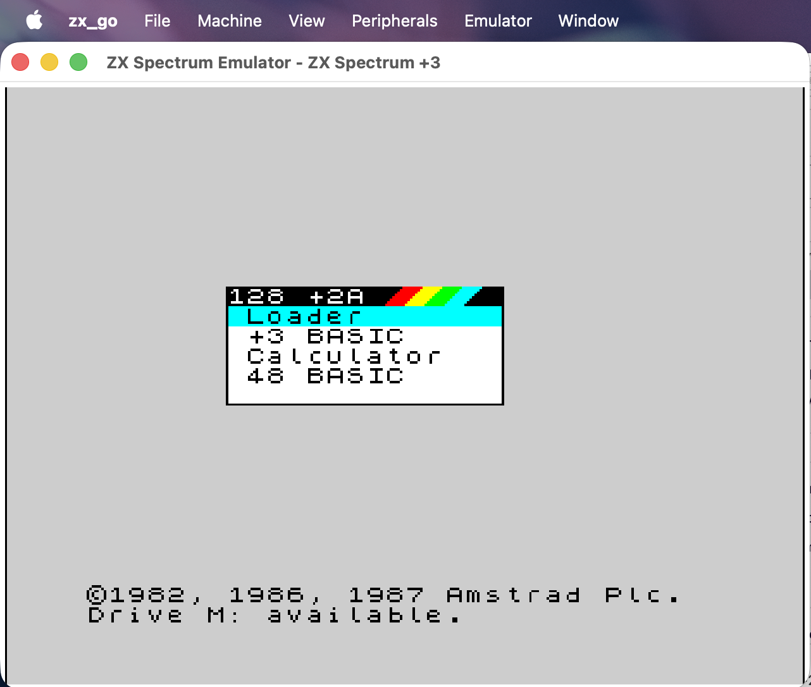
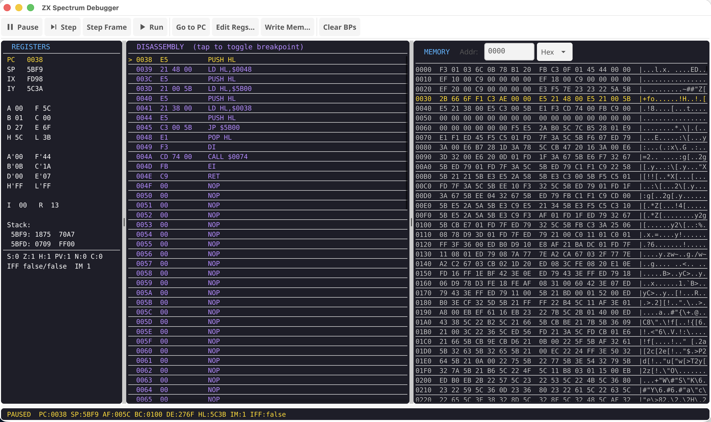

# zx_go

A ZX Spectrum emulator written in Go.

The ZX Spectrum 48K was my first computer, and this project was created as a learning exercise to get to grips with Go. Building an emulator turned out to be a great way to learn the language — it touches concurrency, bit manipulation, real-time rendering, and low-level hardware emulation all at once.



## Features

### Emulation
- **Z80 CPU** — complete instruction set including all prefix groups (CB, ED, DD, FD, DDCB, FDCB), undocumented opcodes, and correct flag behaviour
- **Five Spectrum models** — 48K, 128K, +2, +2A, and +3, each with correct ROM and memory paging
- **+3/+2A 4-ROM paging** — both port 0x7FFD and 0x1FFD with all four special paging modes
- **ULA rendering** — pixel-accurate screen display with attribute colours, bright, and 16-frame flash cycle
- **Mid-frame border effects** — border colour changes are tracked per-scanline for loading stripes and demo effects
- **Beeper audio** — ULA speaker bit driven through the host audio system
- **AY-3-8912 sound chip** — fitted on every model except the original 48K, with correct register selection (port 0xFFFD) and data write (port 0xBFFD) decoding
- **Keyboard** — full 8x5 matrix emulation with CAPS SHIFT, SYMBOL SHIFT, arrow keys, and modifier support
- **Joysticks** — Kempston (port 0x1F), Sinclair Interface 2 left (1-5) and right (6-0), and Cursor/Protek
- **Cycle-accurate timing** — memory contention during active display, port I/O contention with correct patterns for ULA/non-ULA ports, and model-specific contention (no ULA port contention on +2A/+3)
- **R register** — correctly incremented only on M1 opcode fetch cycles

### File Formats
- **Snapshots** — load and save in SNA, Z80 (v1/v2/v3), and SZX formats with full 48K and 128K support
- **TAP/TZX tapes** — load .tap and .tzx files with accurate pilot tones, sync pulses, and data encoding; save out as .tap; built-in tape browser with block listing
- **Fast tape loading** — optional LD-BYTES ROM trap (0x0556 on 48K) that synthesises the load directly from the tape block, bypassing the slow real-time pulse decoding for instant loads
- **+3 disk images** — DSK and EDSK (CPCEMU), UDI, MGT/IMG, TRD, SAD, D40/D80; load and save with full FUSE-level format coverage including weak sectors, IDAM-only sectors, and deleted DAMs
- **RZX input recordings** — record and play back deterministic emulator sessions with FUSE-parity feature set: per-frame instruction count + IN-byte stream, embedded snapshots, autosave/rollback, multi-snapshot recordings, and competition mode
- **Microdrive cartridges** — `.mdr` cartridges for the Sinclair ZX Interface 1 microdrive, the same format used by FUSE / libspectrum (load, save, write-protect, full block-level access)

### Peripherals
- **+3 floppy disk controller** — NEC µPD765A FDC implementation with full READ DATA, WRITE DATA, FORMAT TRACK, READ ID, READ DIAGNOSTIC, SCAN, and SEEK commands; supports two drives (A and B), write-protect toggles, and an optional Speedlock copy-protection workaround
- **Interface 1 / Microdrive** — Sinclair's tape-loop mass storage for the 48K Spectrum: 8 daisy-chained microdrive slots with motor select, GAP/SYNC formatting model, write-protect, and full `.mdr` cartridge round-trip. The Interface 1 v2 ROM is embedded (Amstrad copyright, redistributed with permission via the [spectrumforeveryone/zx-roms](https://github.com/spectrumforeveryone/zx-roms) archive). RS-232 and SinclairNET ports are stubbed (no host plumbing)
- **DISCiPLE** — Miles Gordon Technology disk interface with GDOS ROM and port-level emulation
- **Multiface** — Romantic Robot Multiface 1, 128, and 3 with NMI trigger (F12) and ROM paging
- **Kempston mouse** — 3-port mouse interface (X at 0xFBDF, Y at 0xFFDF, buttons at 0xFADF). Host mouse movement and button events forward to the Spectrum bus when enabled
- **ZX Printer** — Sinclair's 1-bit thermal printer on port 0xFB. Emulates the drum timing so BASIC's `LPRINT` works; accumulates rows into a bitmap that can be saved as PNG via the File menu

### Display
- **Scalable window** — View menu with 100%, 125%, 150%, 200%, and 300% scaling options
- **Full screen** — toggle from the View menu, press Esc to return to windowed mode
- **4:3 aspect ratio** — maintained at all sizes with black letterbox/pillarbox bars
- **Pixel-nearest scaling** — sharp pixels at all zoom levels
- **CRT scanline filter** — optional 2x upscale with darkened alternate rows for a CRT look

### Tools
- **WAV recording** — capture the emulator's audio output to a .wav file
- **Screenshot** — save the current frame as a PNG
- **Poke entry** — apply numeric pokes via a dialog (address + byte)

### Built-in Debugger



A full-featured Z80 debugger accessible from **Emulator > Debugger**:

- **Registers** — all Z80 registers displayed with colour-coded values: PC (yellow), register names (blue), values (white). Includes alternate registers (A'-L'), index registers (IX, IY), interrupt state (IFF1/IFF2, IM), and a stack preview showing the top 4 words at SP
- **Flags** — individual S, Z, H, P/V, N, C indicators with set/clear state
- **Disassembly** — scrollable Z80 disassembly from the current PC with full instruction decoding across all prefix groups. The current instruction is highlighted in yellow (>). Tap any line to toggle a breakpoint (shown in red with *)
- **Memory hex dump** — scrollable view of the entire 64KB address space (0000-FFFF) with hex and ASCII columns. Address entry supports hex, decimal, and octal via a base selector dropdown. PC location highlighted in yellow
- **Breakpoints** — tap disassembly lines to set/clear. When a breakpoint is hit during execution, the emulator automatically pauses. Active breakpoints shown in the status bar
- **Controls** — Pause, Step (single Z80 instruction without triggering interrupts), Step Frame (one full 69888 T-state frame), Run, Go to PC
- **Editing** — modify any register via the Edit Registers dialog; write hex bytes to any memory address via Write Memory
- **Live updates** — all panels refresh at 20Hz while the emulator is running, so you can watch registers change and the disassembly cursor move in real time
- **Status bar** — shows running/paused/halted state, all register pairs, interrupt mode, and active breakpoint addresses

## Downloads

Pre-built binaries for macOS, Windows, and Linux are available on the [Releases](https://github.com/conorarmstrong/zx_go/releases) page.

| Platform | Download |
|----------|----------|
| macOS (Apple Silicon) | `zx_go-macos-arm64.tar.gz` |
| macOS (Intel) | `zx_go-macos-amd64.tar.gz` |
| Windows | `zx_go-windows-amd64.exe.zip` |
| Linux | `zx_go-linux-amd64.tar.gz` |

On macOS/Linux, extract and run:
```bash
tar xzf zx_go-macos-arm64.tar.gz
./zx_go-macos-arm64
```

## Building from source

Requires Go 1.25+ and the system dependencies for [Fyne](https://fyne.io/) (OpenGL, C compiler).

```bash
go build -o zx_go ./cmd/zx_go
```

## Running

```bash
./zx_go
```

The emulator starts in 48K mode by default. Use the menu bar to:

- **File** — load/save snapshots (.sna, .z80, .szx); load tapes (.tap, .tzx) and save as .tap; load +3 disks (.dsk, .edsk, .udi, .mgt/.img, .trd, .sad, .d40/.d80) and save as .dsk; insert/save/eject `.mdr` microdrive cartridges into any of 8 drives; open or record RZX sessions; save screenshot (.png); record audio to .wav; browse the loaded tape's block list; toggle write protection on either disk drive; load a custom ROM
- **Machine** — switch between Spectrum models (48K, 128K, +2, +2A, +3)
- **View** — scale the display (100%-300%), go full screen, or toggle the CRT scanline filter
- **Peripherals** — enable/disable DISCiPLE, Interface 1 (48K only), and Multiface (1, 128, or 3) interfaces, select a joystick (Kempston, Sinclair left/right, Cursor)
- **Emulator** — reboot, pause/resume, enter pokes, open the debugger, view ROM info, trigger NMI (F12)

### Keyboard mapping

| Spectrum key | Host key |
|-------------|----------|
| CAPS SHIFT | Left Shift |
| SYMBOL SHIFT | Right Shift / Ctrl / Alt / Cmd |
| Arrow keys | Arrow keys (mapped to CAPS SHIFT + 5/6/7/8) |
| DELETE | Backspace (CAPS SHIFT + 0) |
| BREAK | F11 (CAPS SHIFT + SPACE) |
| NMI | F12 (Multiface red button) |
| Escape | Exit full screen |

## ROMs

ROM files are embedded in the binary, so no external ROM directory is needed. The emulator includes ROMs for all five models plus peripheral ROMs (Multiface, DISCiPLE/GDOS).

You can override embedded ROMs by placing files in a `roms/` directory alongside the binary. The emulator checks the filesystem first and falls back to embedded ROMs.

## Technical Details

- +3/+2A port decode isolation (0x7FFD vs 0x1FFD require stricter address matching)
- +3 special paging modes with correct slot 3 restore on exit
- Port I/O contention patterns (contended address + ULA port, contended + non-ULA, non-contended + ULA)
- IN instruction behaviour for unhandled ports (always update target register with 0xFF)
- Memory contention timing during active display

## Project Structure

```
cmd/zx_go/         Main application entry point (Fyne GUI)
pkg/
  z80/             Z80 CPU core with StepInstruction for debugger
  ula/             ULA — display, border, audio, tape (TAP/TZX), I/O ports
  memory/          Memory management, bank paging, contention
  keyboard/        Keyboard matrix emulation
  audio/           Beeper audio system
  ay/              AY-3-8912 sound chip (128K and later)
  snapshot/        Snapshot load/save (SNA, Z80, SZX)
  plus3fdc/        +3 floppy disk controller (uPD765A) and disk image parsers
  microdrive/      .mdr cartridge format (Sinclair Interface 1)
  if1/             Interface 1 — shadow ROM, microdrive bus, port I/O
  kempmouse/       Kempston mouse interface
  zxprinter/       Sinclair ZX Printer — 1-bit thermal printer at port 0xFB
  rzx/             RZX input recording — playback and recording with FUSE parity
  testharness/     Headless scripted emulator for end-to-end integration tests
  roms/            ROM loading with embedded fallback
  peripherals/     Peripheral manager
  disciple/        DISCiPLE disk interface
  multiface/       Multiface hardware interface
  debugger/        Built-in Z80 debugger with disassembler
```

## License

This project is provided as-is for educational purposes.
