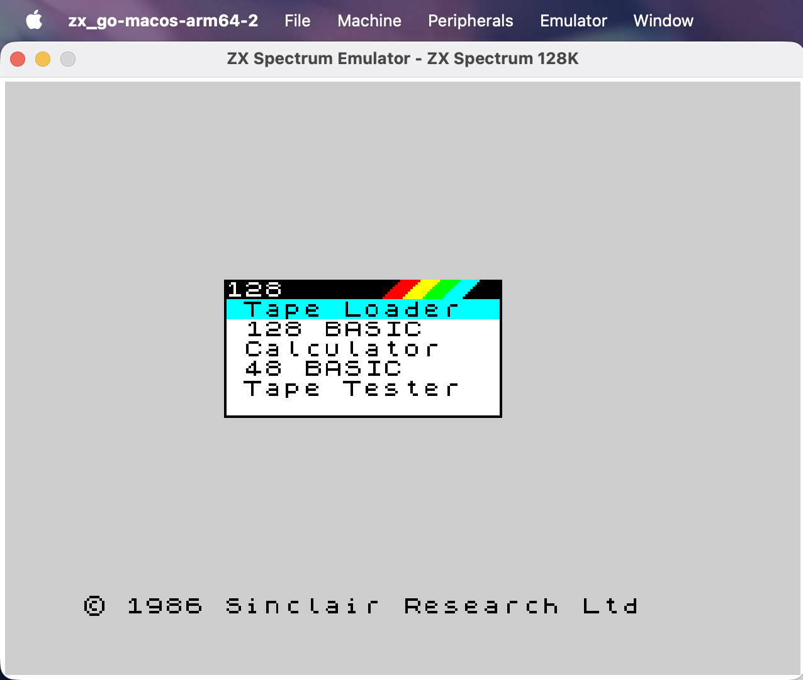

# zx_go

A ZX Spectrum emulator written in Go.

The ZX Spectrum 48K was my first computer, and this project was created as a learning exercise to get to grips with Go. Building an emulator turned out to be a great way to learn the language — it touches concurrency, bit manipulation, real-time rendering, and low-level hardware emulation all at once.

## Features

- **Z80 CPU emulation** — full instruction set including undocumented opcodes, interrupt modes, and alternate register sets
- **Multiple Spectrum models** — 48K, 128K, +2, +2A, and +3 with correct ROM and memory paging
- **ULA rendering** — screen, border (with mid-frame changes), attribute colours, and flash
- **Audio** — beeper sound via the ULA speaker bit
- **Keyboard** — mapped from the host keyboard with modifier key support
- **Snapshot support** — load and save in SNA, Z80, and SZX formats
- **TAP tape loading** — load .tap files and play them into the emulator
- **Peripheral emulation** — DISCiPLE disk interface and Multiface (1, 128, 3) with NMI trigger
- **Built-in debugger** — Z80 debugger with disassembly, memory hex dump, registers, flags, breakpoints, and single-stepping
- **Cycle-accurate timing** — memory and port contention, correct T-state counting, EI delay

## Downloads

Pre-built binaries for macOS, Windows, and Linux are available on the [Releases](https://github.com/conorarmstrong/zx_go/releases) page.

| Platform | Binary |
|----------|--------|
| macOS (Apple Silicon) | `zx_go-macos-arm64` |
| macOS (Intel) | `zx_go-macos-amd64` |
| Windows | `zx_go-windows-amd64.exe` |
| Linux | `zx_go-linux-amd64` |

## Screenshot



## Building from source

Requires Go 1.25+ and the system dependencies for [Fyne](https://fyne.io/) (OpenGL, C compiler).

```bash
go build -o zx_go ./cmd/zx_go
```

## Running

```bash
./zx_go
```

The emulator starts in 48K mode by default. Use the menu bar to:

- **File** — load/save snapshots (.sna, .z80, .szx), load TAP tapes, or select a ROM
- **Machine** — switch between Spectrum models (48K, 128K, +2, +2A, +3)
- **Peripherals** — enable/disable DISCiPLE and Multiface interfaces
- **Emulator** — reboot, pause/resume, open debugger, view ROM info, trigger NMI (F12)

## Debugger

Open from **Emulator > Debugger**. Features:

- **Registers** — all Z80 registers with colour-coded values, flag indicators (S, Z, H, P/V, N, C), IFF/IM state, and stack preview
- **Memory** — hex dump with address navigation, PC highlighted in yellow, breakpoints in red
- **Disassembly** — full Z80 instruction decoding from current PC with cursor tracking
- **Breakpoints** — set by address, execution pauses automatically when hit
- **Controls** — Pause, Step (single instruction), Step Frame, Run
- **Editing** — modify registers and write to memory via dialogs
- **Live updates** — all panels refresh at 20Hz while running

## ROMs

ROM files are embedded in the binary, so no external ROM directory is needed. You can override embedded ROMs by placing files in a `roms/` directory alongside the binary.

## Architecture

The emulator was developed with reference to the [FUSE](http://fuse-emulator.sourceforge.net/) emulator source code for accuracy, particularly around:

- +3/+2A 4-ROM paging (port 0x7FFD + 0x1FFD)
- +3 special paging modes
- Port I/O contention patterns
- Memory contention during active display
- Port decode isolation between 0x7FFD and 0x1FFD on +3/+2A
- IN instruction behaviour for unhandled ports

## Project Structure

```
cmd/zx_go/         Main application entry point (Fyne GUI)
pkg/
  z80/             Z80 CPU core
  ula/             ULA — display rendering, border, audio, I/O ports
  memory/          Memory management and bank paging
  keyboard/        Keyboard matrix emulation
  audio/           Beeper audio system
  snapshot/        Snapshot load/save (SNA, Z80, SZX)
  roms/            ROM loading and model configuration (with embedded ROMs)
  peripherals/     Peripheral manager
  disciple/        DISCiPLE disk interface
  multiface/       Multiface hardware interface
  debugger/        Built-in Z80 debugger with disassembly
```

## License

This project is provided as-is for educational purposes.
